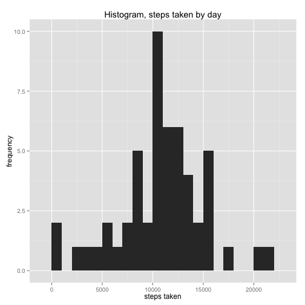
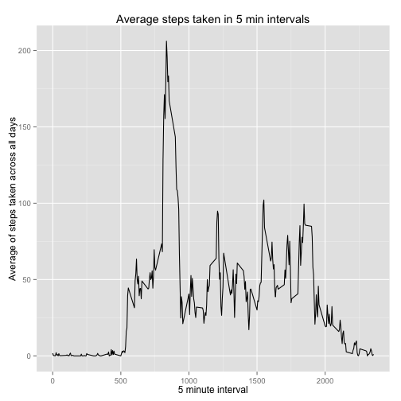
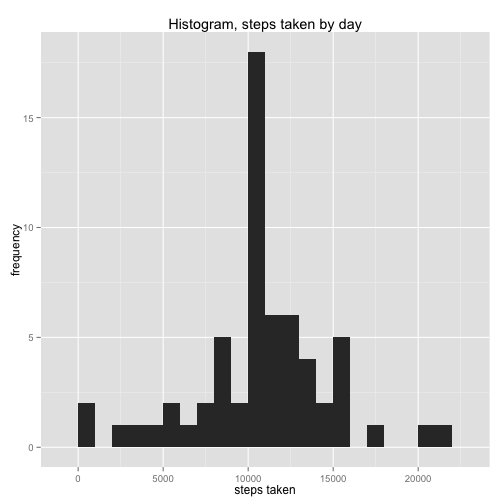
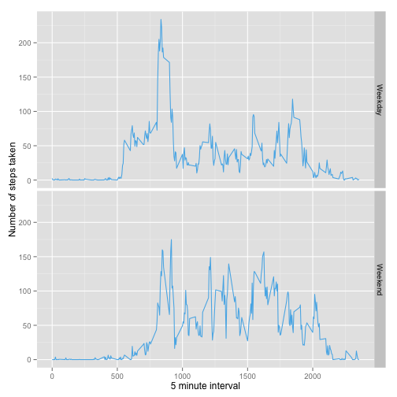

#Reproducible Research Course Project 1
Jonathan Stone  
December 13, 2014  
=========================================================

The data for this assignment can be downloaded from [the course web site](https://d396qusza40orc.cloudfront.net/repdata%2Fdata%2Factivity.zip):

Dataset: Activity monitoring data [52K]
The variables included in this dataset are:

steps: Number of steps taking in a 5-minute interval (missing values are coded as NA)

date: The date on which the measurement was taken in YYYY-MM-DD format

interval: Identifier for the 5-minute interval in which measurement was taken

The dataset is stored in a comma-separated-value (CSV) file and there are a total of 17,568 observations in this dataset.

#Assignment

This assignment will be described in multiple parts. You will need to write a report that answers the questions detailed below. Ultimately, you will need to complete the entire assignment in a single R markdown document that can be processed by knitr and be transformed into an HTML file.


Loading and preprocessing the data

Show any code that is needed to

Load the data (i.e. read.csv())


```r
unzip(zipfile="activity.zip")
data <- read.csv("activity.csv")
```

Process/transform the data (if necessary) into a format suitable for your analysis

##What is mean total number of steps taken per day?

For this part of the assignment, you can ignore the missing values in the dataset.

- Make a histogram of the total number of steps taken each day


```r
library("plyr")
newdata <- ddply(data, "date", summarize, total.steps=sum(steps))

library("ggplot2")
##uses ggplot to create a histogram
ggplot(newdata, aes(total.steps)) +
  geom_histogram(binwidth=1000) + 
  ggtitle("Histogram, steps taken by day") +
  xlab("steps taken") + 
  ylab("frequency") 
```

 

 - Calculate and report the mean and median total number of steps taken per day


```r
meanmedian <- ddply(data, "date", summarize, mean.count=mean(steps), median.count=median(steps))
meanmedian
```

```
##          date mean.count median.count
## 1  2012-10-01         NA           NA
## 2  2012-10-02  0.4375000            0
## 3  2012-10-03 39.4166667            0
## 4  2012-10-04 42.0694444            0
## 5  2012-10-05 46.1597222            0
## 6  2012-10-06 53.5416667            0
## 7  2012-10-07 38.2465278            0
## 8  2012-10-08         NA           NA
## 9  2012-10-09 44.4826389            0
## 10 2012-10-10 34.3750000            0
## 11 2012-10-11 35.7777778            0
## 12 2012-10-12 60.3541667            0
## 13 2012-10-13 43.1458333            0
## 14 2012-10-14 52.4236111            0
## 15 2012-10-15 35.2048611            0
## 16 2012-10-16 52.3750000            0
## 17 2012-10-17 46.7083333            0
## 18 2012-10-18 34.9166667            0
## 19 2012-10-19 41.0729167            0
## 20 2012-10-20 36.0937500            0
## 21 2012-10-21 30.6284722            0
## 22 2012-10-22 46.7361111            0
## 23 2012-10-23 30.9652778            0
## 24 2012-10-24 29.0104167            0
## 25 2012-10-25  8.6527778            0
## 26 2012-10-26 23.5347222            0
## 27 2012-10-27 35.1354167            0
## 28 2012-10-28 39.7847222            0
## 29 2012-10-29 17.4236111            0
## 30 2012-10-30 34.0937500            0
## 31 2012-10-31 53.5208333            0
## 32 2012-11-01         NA           NA
## 33 2012-11-02 36.8055556            0
## 34 2012-11-03 36.7048611            0
## 35 2012-11-04         NA           NA
## 36 2012-11-05 36.2465278            0
## 37 2012-11-06 28.9375000            0
## 38 2012-11-07 44.7326389            0
## 39 2012-11-08 11.1770833            0
## 40 2012-11-09         NA           NA
## 41 2012-11-10         NA           NA
## 42 2012-11-11 43.7777778            0
## 43 2012-11-12 37.3784722            0
## 44 2012-11-13 25.4722222            0
## 45 2012-11-14         NA           NA
## 46 2012-11-15  0.1423611            0
## 47 2012-11-16 18.8923611            0
## 48 2012-11-17 49.7881944            0
## 49 2012-11-18 52.4652778            0
## 50 2012-11-19 30.6979167            0
## 51 2012-11-20 15.5277778            0
## 52 2012-11-21 44.3993056            0
## 53 2012-11-22 70.9270833            0
## 54 2012-11-23 73.5902778            0
## 55 2012-11-24 50.2708333            0
## 56 2012-11-25 41.0902778            0
## 57 2012-11-26 38.7569444            0
## 58 2012-11-27 47.3819444            0
## 59 2012-11-28 35.3576389            0
## 60 2012-11-29 24.4687500            0
## 61 2012-11-30         NA           NA
```

##What is the average daily activity pattern?

- Make a time series plot (i.e. type = "l") of the 5-minute interval (x-axis) and the average number of steps taken, averaged across all days (y-axis)


```r
interval <- ddply(data, "interval", summarize, mean.count=mean(steps, na.rm=TRUE))

ggplot(interval, aes(x=interval, y=mean.count)) + 
  geom_line() +
  ggtitle("Average steps taken in 5 min intervals") +
  xlab("5 minute interval") + 
  ylab("Average of steps taken across all days")
```

 

- Which 5-minute interval, on average across all the days in the dataset, contains the maximum number of steps?


```r
max(interval$mean.count)
```

```
## [1] 206.1698
```

##Imputing missing values

Note that there are a number of days/intervals where there are missing values (coded as NA). The presence of missing days may introduce bias into some calculations or summaries of the data.

- Calculate and report the total number of missing values in the dataset (i.e. the total number of rows with NAs)


```r
sum(is.na(data$steps))
```

```
## [1] 2304
```

- Devise a strategy for filling in all of the missing values in the dataset. The strategy does not need to be sophisticated. For example, you could use the mean/median for that day, or the mean for that 5-minute interval, etc.

For this question, I have used a mean replacement strategy, as it will maintain the mean for the data, and since no relationship identification questions will be asked, the attenuation will not be a concern. The mean for each 5 minute interval will be used to replace the NA values. 

- Create a new dataset that is equal to the original dataset but with the missing data filled in.


```r
##Creating a new data frame to keep it fresh
nonas <- data

##Merging data frame from earlier to get mean value for each interval
intervalnonas <- merge(nonas, interval, by="interval")

##Replacing NA values with mean from each interval
intervalnonas$steps[is.na(intervalnonas$steps)] <- intervalnonas$mean.count[is.na(intervalnonas$steps)]
```

- Make a histogram of the total number of steps taken each day and Calculate and report the mean and median total number of steps taken per day. Do these values differ from the estimates from the first part of the assignment? What is the impact of imputing missing data on the estimates of the total daily number of steps?


```r
nonas2 <- ddply(intervalnonas, "date", summarize, total.steps=sum(steps))

ggplot(nonas2, aes(total.steps)) +
  geom_histogram(binwidth=1000) + 
  ggtitle("Histogram, steps taken by day") +
  xlab("steps taken") + 
  ylab("frequency") 
```

 

```r
meanmedianNA <- ddply(intervalnonas, "date", summarize, median=median(steps), mean=mean(steps))
meanmedianNA
```

```
##          date   median       mean
## 1  2012-10-01 34.11321 37.3825996
## 2  2012-10-02  0.00000  0.4375000
## 3  2012-10-03  0.00000 39.4166667
## 4  2012-10-04  0.00000 42.0694444
## 5  2012-10-05  0.00000 46.1597222
## 6  2012-10-06  0.00000 53.5416667
## 7  2012-10-07  0.00000 38.2465278
## 8  2012-10-08 34.11321 37.3825996
## 9  2012-10-09  0.00000 44.4826389
## 10 2012-10-10  0.00000 34.3750000
## 11 2012-10-11  0.00000 35.7777778
## 12 2012-10-12  0.00000 60.3541667
## 13 2012-10-13  0.00000 43.1458333
## 14 2012-10-14  0.00000 52.4236111
## 15 2012-10-15  0.00000 35.2048611
## 16 2012-10-16  0.00000 52.3750000
## 17 2012-10-17  0.00000 46.7083333
## 18 2012-10-18  0.00000 34.9166667
## 19 2012-10-19  0.00000 41.0729167
## 20 2012-10-20  0.00000 36.0937500
## 21 2012-10-21  0.00000 30.6284722
## 22 2012-10-22  0.00000 46.7361111
## 23 2012-10-23  0.00000 30.9652778
## 24 2012-10-24  0.00000 29.0104167
## 25 2012-10-25  0.00000  8.6527778
## 26 2012-10-26  0.00000 23.5347222
## 27 2012-10-27  0.00000 35.1354167
## 28 2012-10-28  0.00000 39.7847222
## 29 2012-10-29  0.00000 17.4236111
## 30 2012-10-30  0.00000 34.0937500
## 31 2012-10-31  0.00000 53.5208333
## 32 2012-11-01 34.11321 37.3825996
## 33 2012-11-02  0.00000 36.8055556
## 34 2012-11-03  0.00000 36.7048611
## 35 2012-11-04 34.11321 37.3825996
## 36 2012-11-05  0.00000 36.2465278
## 37 2012-11-06  0.00000 28.9375000
## 38 2012-11-07  0.00000 44.7326389
## 39 2012-11-08  0.00000 11.1770833
## 40 2012-11-09 34.11321 37.3825996
## 41 2012-11-10 34.11321 37.3825996
## 42 2012-11-11  0.00000 43.7777778
## 43 2012-11-12  0.00000 37.3784722
## 44 2012-11-13  0.00000 25.4722222
## 45 2012-11-14 34.11321 37.3825996
## 46 2012-11-15  0.00000  0.1423611
## 47 2012-11-16  0.00000 18.8923611
## 48 2012-11-17  0.00000 49.7881944
## 49 2012-11-18  0.00000 52.4652778
## 50 2012-11-19  0.00000 30.6979167
## 51 2012-11-20  0.00000 15.5277778
## 52 2012-11-21  0.00000 44.3993056
## 53 2012-11-22  0.00000 70.9270833
## 54 2012-11-23  0.00000 73.5902778
## 55 2012-11-24  0.00000 50.2708333
## 56 2012-11-25  0.00000 41.0902778
## 57 2012-11-26  0.00000 38.7569444
## 58 2012-11-27  0.00000 47.3819444
## 59 2012-11-28  0.00000 35.3576389
## 60 2012-11-29  0.00000 24.4687500
## 61 2012-11-30 34.11321 37.3825996
```

Most notably, including the mean data for each interval has reduced the variance for the data. 

##Are there differences in activity patterns between weekdays and weekends?

For this part the weekdays() function may be of some help here. Use the dataset with the filled-in missing values for this part.

- Create a new factor variable in the dataset with two levels – “weekday” and “weekend” indicating whether a given date is a weekday or weekend day.


```r
##Converting date from a factor to date
data$date <- as.Date(data$date, format="%Y-%m-%d")

days <- weekdays(data$date, abbreviate=FALSE)

weekend <- data.frame()

for (i in 1:length(days)){
  if (days[i]=="Sunday" | days[i]=="Saturday"){
    weekend[i, 1]="Weekend"
  }
  else {
    weekend[i, 1]="Weekday"
  }
}

daydata <- cbind(data, weekend)
colnames(daydata)[[4]]="weekend"
```

- Make a panel plot containing a time series plot (i.e. type = "l") of the 5-minute interval (x-axis) and the average number of steps taken, averaged across all weekday days or weekend days (y-axis). See the README file in the GitHub repository to see an example of what this plot should look like using simulated data.


```r
averages <- aggregate(steps ~ interval + weekend, data=daydata, mean)

ggplot(averages, aes(interval, steps)) + 
  geom_line(colour="#56B4E9") + 
  facet_grid(weekend ~ .) +
  xlab("5 minute interval") +
  ylab("Number of steps taken")
```

 


